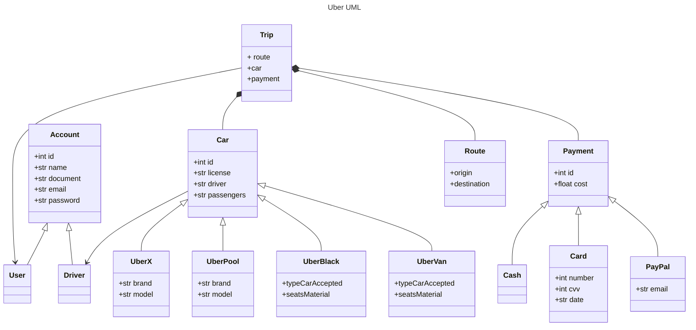

# Curso de Programación Orientada a Objetos: POO 
Proyecto que desarrolle en el curso de POO de @Platzi.
## Análisis de los objetos, clases y métodos de la aplicación Uber
Para resolver un problema como desarrollador es de gran utilidad dividirlo en subproblemas y generar un modelo que te permita implementar las soluciones en código. A lo largo de este curso analizamos Uber, una de las aplicaciones más usadas en el mundo, para entender cómo está construida. A partir de este análisis hicimos la extracción y definición de los objetos, clases y métodos que conforman la aplicación, usamos el siguiente diagrama UML para modelarla y, finalmente, usando diferentes lenguajes como Java, PHP y Python hicimos la implementación de las clases y objetos de la aplicación.

### Conceptos básicos
#### Abstracción
#### Herencia
#### Encapsulamiento
El Encapsulamiento es hacer que un dato sea inviolable, inalterable cuando se le asigne un modificador de acceso.
#### Polimorfismo
Muchas formas. Poli = muchas, morfismo = formas. NO es Poliformismo
Es construir métodos con el mismo nombre pero con comportamiento diferente 

📕Referencias

Si te interesa saber más sobre el curso te dejo los siguientes enlaces:
<A HREF="https://platzi.com/cursos/oop/"> 🔗Curso </A>

<A HREF="https://static.platzi.com/media/public/uploads/programacion-orientada-a-objetos-poo_c4774196-cfdb-412e-bae5-210a97d78f8b.pdf"> 🔗Slides </A>

Quieres hacer diagramas UML como este?, [aquí](https://github.com/mermaid-js/mermaid) te dejo la herramienta que use.
  

